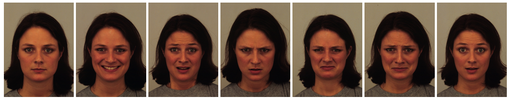

# Emotion Transfer
Generate images of different emotional state of someone



### Train
```
python .\main.py --dataset='RaFD' --c_dim=7 --num_workers=4 --model_save_step=1000 --batch_size=4  
```

### Train with content loss
```
python .\main.py --dataset='RaFD' --c_dim=7 --num_workers=4 --model_save_step=1000 --batch_size=4 --lambda_star=1 --star_loss
```